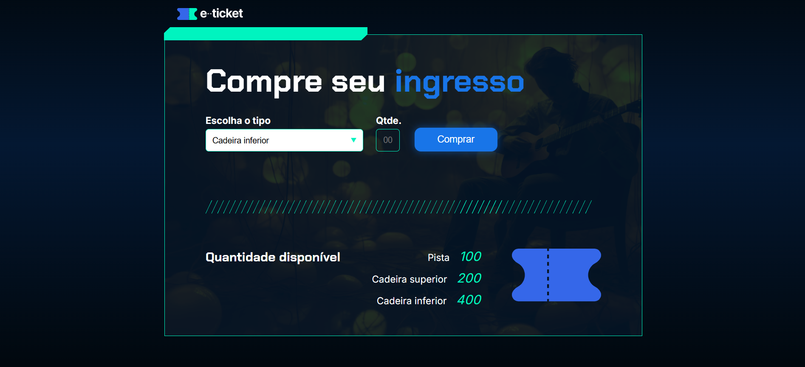

# 🎟️ e-Ticket | Sistema de Compra de Ingressos Online

Projeto web desenvolvido para simular a **compra de ingressos online para eventos**, permitindo ao usuário selecionar o tipo de ingresso, informar a quantidade desejada e realizar a compra com atualização automática da disponibilidade em tela.

---

## 📌 Sobre o Projeto

O **e-Ticket** é uma aplicação frontend criada com o objetivo de praticar:

- Manipulação do DOM com JavaScript
- Captura de dados de formulários
- Atualização dinâmica de elementos HTML
- Estruturação de páginas com HTML5
- Estilização moderna com CSS3

A aplicação simula uma plataforma simples de venda de ingressos, onde o usuário pode escolher entre diferentes setores disponíveis e efetuar a compra conforme a quantidade desejada.

---

## 🚀 Funcionalidades

✅ Seleção do tipo de ingresso  
✅ Escolha da quantidade desejada  
✅ Validação de disponibilidade de ingressos  
✅ Atualização automática da quantidade restante  
✅ Alerta de compra realizada com sucesso  
✅ Alerta de quantidade indisponível  
✅ Interface moderna e intuitiva  

---

## 🛠️ Tecnologias Utilizadas

- **HTML5** → Estrutura da aplicação
- **CSS3** → Estilização e layout responsivo
- **JavaScript** → Regras de negócio e interatividade

---

## 📂 Estrutura do Projeto

```bash
INGRESSO/
│
├── assets/
│   ├── PNG/
│   ├── SVG/
│   ├── image1.png
│   ├── Ingresso.svg
│   ├── Logo-e-tricket.png
│   └── preview.png
│
├── js/
│   └── app.js
│
├── styles/
│   ├── _reset.css
│   └── style.css
│
└── index.html
```

---

## 🎮 Como Funciona

O sistema disponibiliza três categorias de ingressos:

- 🎫 **Pista** → 100 unidades
- 🎫 **Cadeira Superior** → 200 unidades
- 🎫 **Cadeira Inferior** → 400 unidades

### Fluxo de compra:

1. Usuário seleciona o tipo de ingresso
2. Informa a quantidade desejada
3. Clica no botão **Comprar**
4. O JavaScript verifica:
   - Se existe quantidade suficiente disponível
5. Caso exista:
   - Subtrai da quantidade total
   - Atualiza na tela
   - Exibe mensagem de sucesso
6. Caso não exista:
   - Exibe alerta de indisponibilidade

---

## 💻 Lógica Implementada em JavaScript

O arquivo `app.js` contém:

### ✔ Função principal de compra

Responsável por identificar o tipo de ingresso selecionado e direcionar para a função específica:

```javascript
function comprar() {
    let tipo = document.getElementById('tipo-ingresso');
    let qtd = parseInt(document.getElementById('qtd').value);

    if (tipo.value == 'pista') {
        comprarPista(qtd);
    } else if (tipo.value == 'superior') {
        comprarSuperior(qtd);
    } else {
        comprarInferior(qtd);
    }
}
```

---

### ✔ Funções de validação por setor

Cada setor possui uma função própria para:

- Ler a quantidade disponível
- Validar a compra
- Atualizar a interface

Exemplo:

```javascript
function comprarPista(qtd) {
    let qtdPista = parseInt(document.getElementById('qtd-pista').textContent);

    if (qtd > qtdPista) {
        alert('Quantidade indisponível para tipo pista');
    } else {
        qtdPista = qtdPista - qtd;
        document.getElementById('qtd-pista').textContent = qtdPista;
        alert('Compra realizada com sucesso!');
    }
}
```

---

## 🎨 Interface do Sistema

A interface foi construída com:

- Layout centralizado
- Gradiente escuro moderno
- Elementos gráficos personalizados
- Tipografia com Google Fonts
- Botões e inputs estilizados

---

## ▶️ Como Executar

### 1. Clone o repositório

```bash
git clone https://github.com/JoseFelisbino/ingresso-online.git
```

---

### 2. Abra a pasta do projeto

```bash
cd ingresso-online
```

---

### 3. Execute o arquivo `index.html`

Basta abrir no navegador  
ou utilizar a extensão **Live Server** no VS Code.

---

## 📸 Preview do Projeto



---

## 🎯 Objetivos de Aprendizagem

Este projeto foi desenvolvido para praticar:

- JavaScript básico e intermediário
- Eventos de clique
- Manipulação de `textContent`
- Uso de `parseInt()`
- Estruturas condicionais
- Organização de arquivos frontend
- Design de interfaces web

---

## 👨‍💻 Autor

Desenvolvido por **José Felisbino**

🔗 GitHub: [JoseFelisbino](https://github.com/JoseFelisbino)

---

## 📄 Licença

Este projeto está livre para fins de estudo e aprendizado.